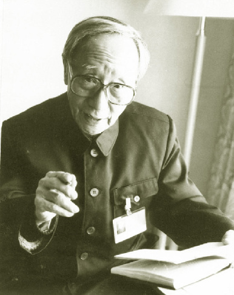

# 爱新觉罗·溥杰

- 姓名：爱新觉罗·溥杰
- 性别：男
- 国籍：中国
- 出生日期：1907年4月16日
- 去世日期：1994年2月28日
- 去世原因：因病逝世

# 生平简介

爱新觉罗·溥杰，出生于北京，清朝末代皇帝溥仪的弟弟。1929年赴日本留学，1935年回国，曾任伪满洲国宫内府侍从武官。1945年被苏联红军俘虏，1950年移交中国，1960年获得特赦。后任全国人大常委会委员、全国政协常委等职。1994年2月28日在北京逝世，享年87岁。

# 主要贡献

溥杰致力于中日友好交流，撰写了《溥杰自传》等著作，为研究清朝历史提供了珍贵资料。他积极参与社会公益事业，为国家建设做出了贡献。

# 参考资料

- 百度百科链接：https://m.baike.com/wiki/%E7%88%B1%E6%96%B0%E8%A觉罗%C2%B7%E6%B0%AE%E6%9D%B0/355617