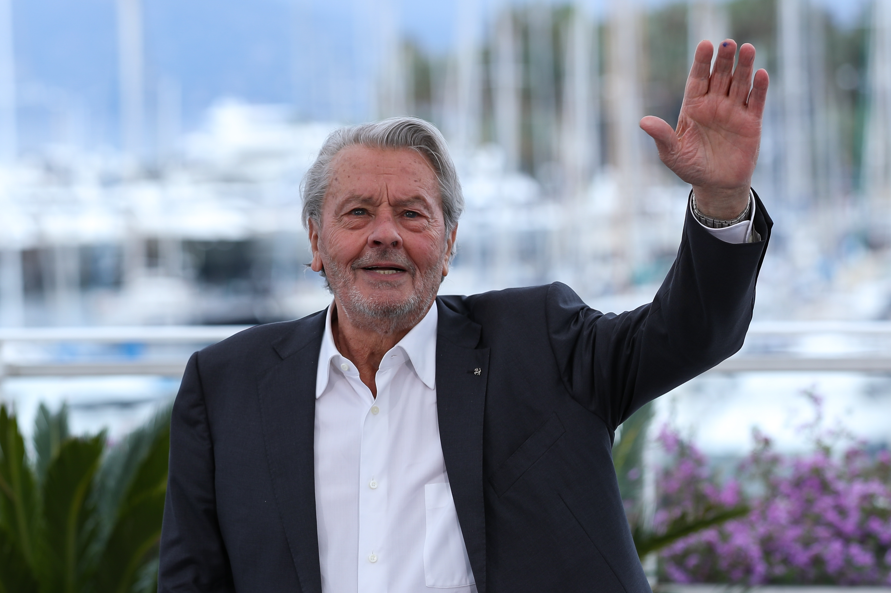

# 阿兰·德龙（Alain Delon）

- 姓名：阿兰·德龙（Alain Delon）
- 性别：男
- 国籍：法国
- 出生日期：1935年11月8日
- 去世日期：2024年8月18日
- 去世原因：自然衰老

# 生平简介

阿兰·德龙，法国传奇影星。2024年8月18日在法国杜希逝世，享年88岁。

# 主要贡献

主演《独行杀手》《佐罗》《豹》等经典影片，是20世纪欧洲影坛的标志性人物。

# 参考资料

- 百度百科链接：https://baike.baidu.com/item/%E9%98%BF%E5%85%B0%C2%B7%E5%BE%B7%E9%BE%99
