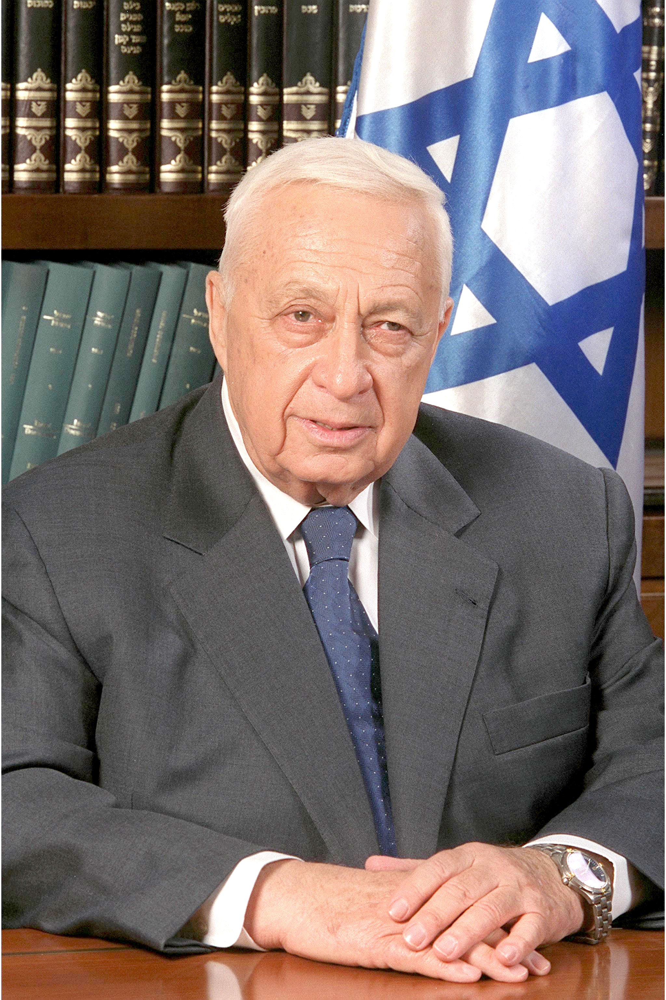

# 沙龙（Ariel Sharon）

- 姓名：沙龙（Ariel Sharon）
- 性别：男
- 国籍：以色列
- 出生日期：1928年2月26日
- 去世日期：2014年1月11日
- 去世原因：长期昏迷后逝世

# 生平简介

阿里埃勒·沙龙，以色列政治家和军事家，生于巴勒斯坦地区。2001年至2006年任以色列总理。2006年中风后长期昏迷，2014年1月11日在特拉维夫逝世，享年85岁。

# 主要贡献

作为军人参加多次中东战争；任总理期间推行单边撤离加沙计划。

# 参考资料

- 百度百科链接：
