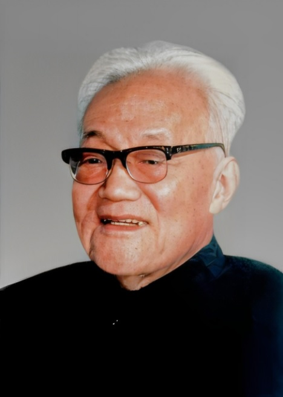

# 巴金

- 姓名：巴金
- 性别：男
- 国籍：中国
- 出生日期：1904年11月25日
- 去世日期：2005年10月17日
- 去世原因：因病医治无效

# 生平简介

巴金，原名李尧棠，四川成都人，中国现代文学巨匠。早年赴法国留学，创作《家》《春》《秋》等名著。曾任中国作家协会主席。2005年10月17日在上海逝世，享年101岁。

# 主要贡献

代表作《家》《春》《秋》（激流三部曲）、《寒夜》《随想录》等，深刻影响中国现当代文学；倡导讲真话，晚年捐献大量藏书与稿费。

# 参考资料

- 百度百科链接：https://baike.baidu.com/item/%E5%B7%B4%E9%87%91
