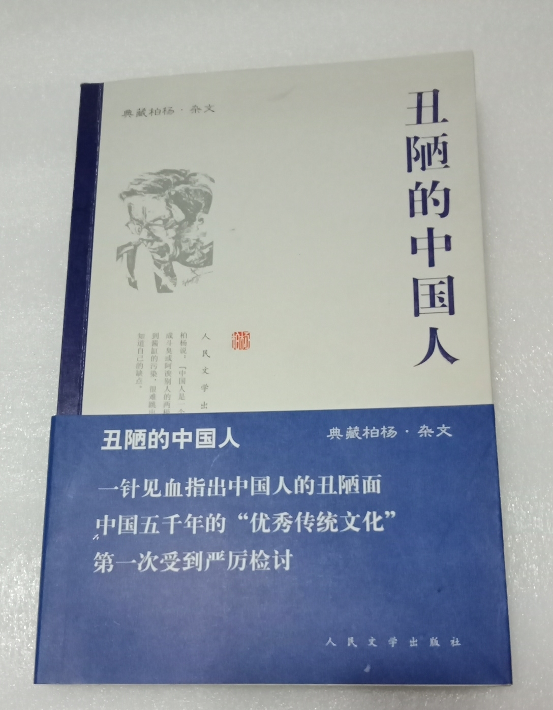

# 柏杨

- 姓名：柏杨
- 性别：男
- 国籍：中国（台湾）
- 出生日期：1920年3月7日
- 去世日期：2008年4月29日
- 去世原因：因病医治无效

# 生平简介

柏杨，本名郭衣洞，河南开封人，台湾著名作家、历史学家。著有《丑陋的中国人》《中国人史纲》等。2008年4月29日在台北逝世，享年89岁。

# 主要贡献

以辛辣笔锋批判国民性，著有《丑陋的中国人》；历史通俗写作影响广泛，推动两岸文化交流。

# 参考资料

- 百度百科链接：https://baike.baidu.com/item/%E6%9F%8F%E6%9D%A8
