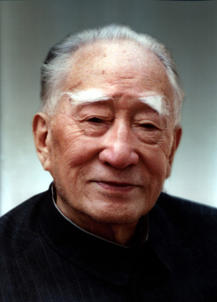

# 薄一波

- 姓名：薄一波
- 性别：男
- 国籍：中国
- 出生日期：1908年2月6日
- 去世日期：2007年1月15日
- 去世原因：因病医治无效

# 生平简介

薄一波，山西定襄人，中国共产党的优秀党员，久经考验的忠诚的共产主义战士。1925年加入中国共产党。曾创建山西抗日根据地。新中国成立后长期负责经济工作，曾任国务院副总理、国家经济委员会主任。2007年1月15日在北京逝世，享年99岁。

# 主要贡献

长期主持国家经济工作，参与新中国经济建设的组织与领导，为国民经济恢复和发展作出重要贡献。

# 参考资料

- 百度百科链接：https://baike.baidu.com/item/%E8%96%84%E4%B8%80%E6%B3%A2
