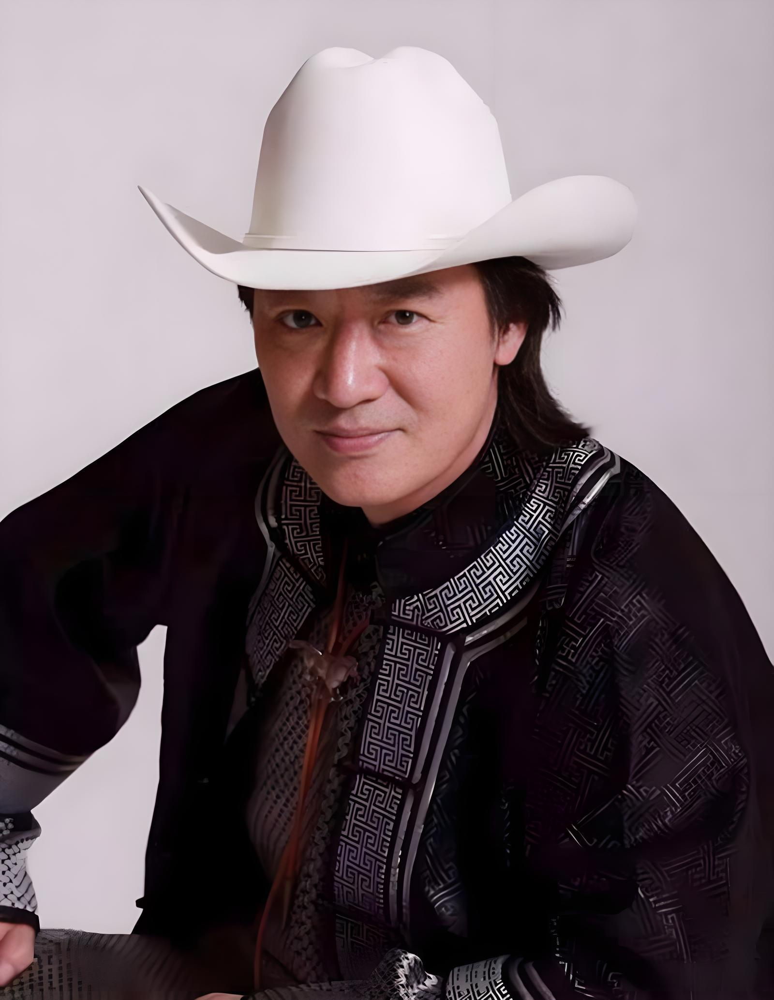

# 布仁巴雅尔

- 姓名：布仁巴雅尔
- 性别：男
- 国籍：中国
- 出生日期：1960年3月6日
- 去世日期：2018年9月19日
- 去世原因：心肌梗死

# 生平简介

布仁巴雅尔，蒙古族，出生于内蒙古呼伦贝尔，国家一级演员。1978年考入鄂温克族自治旗乌兰牧骑，开始文艺生涯。1985年考入内蒙古艺术学院，毕业后分配到呼伦贝尔盟民族歌舞团。2006年，他与妻子乌日娜、女儿诺尔曼组成"吉祥三宝"组合，登上央视春晚演唱同名歌曲《吉祥三宝》，一夜成名。歌曲融合蒙古族音乐元素与现代流行风格，歌词温馨质朴，表达了家庭的和谐美好。2011年收养孤儿乌达木，乌达木在《中国达人秀》中获得"天使的微笑"奖项。2018年9月19日因心肌梗塞在家中逝世，享年58岁。

# 主要贡献

布仁巴雅尔是蒙古族音乐的杰出代表，致力于传承和弘扬蒙古族文化。《吉祥三宝》以其独特的民族风格和温馨的家庭主题，成为华语乐坛经典作品，被广泛传唱。他演唱的《天边》等歌曲也深受听众喜爱。他积极参与公益事业，收养孤儿，资助贫困学生，展现了艺术家的社会责任。他的音乐作品将蒙古族传统音乐与现代元素完美融合，推动了民族音乐的传播与发展。

# 参考资料

- 百度百科链接：https://m.baike.com/wiki/%E5%B8%83%E4%BB%81%E5%B7%B4%E9%9B%85%E5%B0%94/19317068