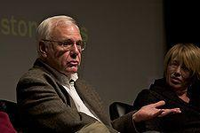

# 查尔斯·萨克尔

- 姓名：Charles P. Thacker（查尔斯·萨克尔）
- 性别：男
- 国籍：美国
- 出生日期：1943年2月26日
- 去世日期：2017年6月12日
- 去世原因：自然逝世

# 生平简介

出生于美国加州帕萨迪纳，1967年在加州大学伯克利分校物理系获得学士学位。1970年加盟施乐公司Palo Alto研究中心，先后担任MAXC时分操作系统项目负责人、Alto个人计算系统的首席设计师。1983年加入DEC公司参与创建著名的SRC（系统研究中心）。后加入微软担任技术院士。美国工程院院士、美国艺术与科学院院士、计算机协会会士。

# 主要贡献

设计与实现了第一台现代个人电脑Xerox Alto，配有鼠标、图形化用户界面和局域网，是现代PC的鼻祖。参与以太网、激光打印机等的设计与开发。主持设计了第一个多处理器工作站DEC Firefly和第一个Alpha架构多处理器。2009年获图灵奖。

# 参考资料

- 百度百科链接：https://www.baike.com/wiki/%E6%9F%A5%E5%B0%94%E6%96%AF%C2%B7%E8%90%A8%E5%85%8B%E5%B0%94
