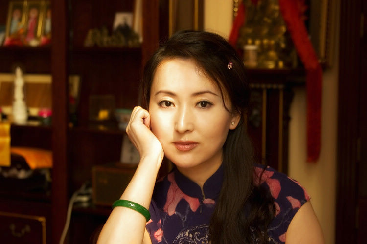

# 陈晓旭

- 姓名：陈晓旭
- 性别：女
- 国籍：中国
- 出生日期：1965年10月29日
- 去世日期：2007年5月13日
- 去世原因：乳腺癌

# 生平简介

陈晓旭是中国内地女演员，出生于辽宁鞍山。1987年因在电视剧《红楼梦》中饰演林黛玉一角成为经典，被誉为"最美林黛玉"。2007年因患乳腺癌去世，享年42岁。去世前已出家，法号妙真。

# 主要贡献

主演87版电视剧《红楼梦》中的林黛玉，成为无法超越的经典角色；参演《家春秋》《黑葡萄》等影视作品；她的表演深入人心，让林黛玉形象成为中国文化符号。

# 参考资料

- 百度百科链接：https://m.baike.com/wiki/%E9%99%88%E6%99%93%E6%97%AD/19308977
