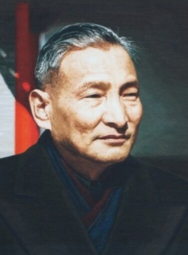

# 陈云

- 姓名：陈云
- 性别：男
- 国籍：中国
- 出生日期：1905年6月13日
- 去世日期：1995年4月10日
- 去世原因：因病逝世

# 生平简介

陈云，江苏青浦（今属上海）人，中国共产党的杰出领导人，中国社会主义经济建设的开创者和奠基人之一。1934年当选中央政治局委员，新中国成立后历任政务院副总理、中共中央副主席、中央纪律检查委员会第一书记等职。在改革开放初期，与邓小平共同主导经济体制改革。1995年4月10日在北京逝世。

# 主要贡献

长期主持中国财政经济工作，提出"鸟笼经济"思想，主张在计划经济框架内发展市场调节；在改革开放初期对国民经济调整和经济体制改革发挥了重要指导作用；著有《陈云文选》。

# 参考资料

- 百度百科链接：
