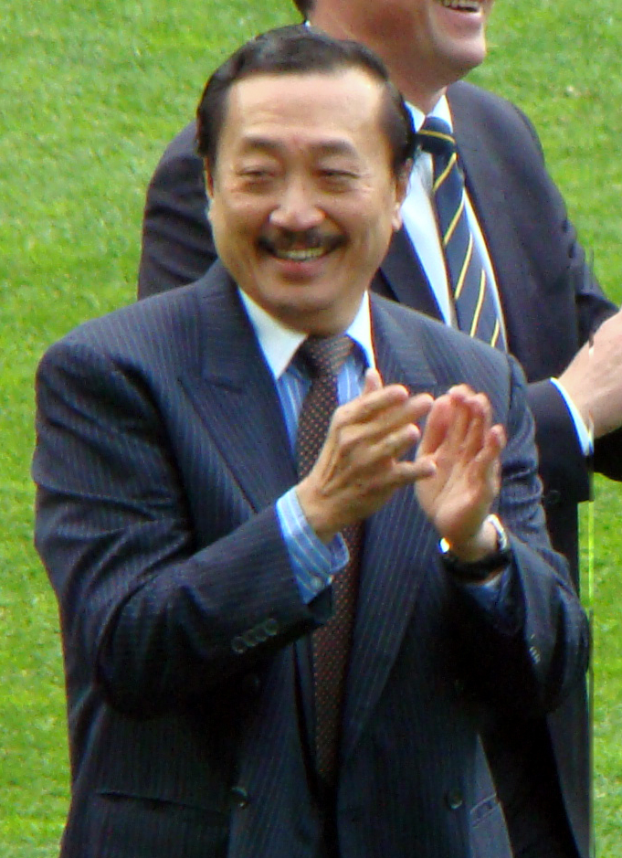

# 陈志远

- 姓名：陈志远
- 性别：男
- 国籍：中国
- 出生日期：1950年2月16日
- 去世日期：2011年3月16日
- 去世原因：大肠癌

# 生平简介

陈志远，出生于中国台湾，中国台湾著名作曲家、编曲家。1971年开始从事音乐创作，1980年为苏芮创作《一样的月光》，一举成名。他创作了《是否》《跟着感觉走》《明天会更好》等经典歌曲。他曾获得台湾金曲奖最佳作曲奖等多项荣誉。2011年3月16日因癌症在台北逝世，享年61岁。

# 主要贡献

陈志远是台湾乐坛的重要人物，被誉为"编曲教父"。他创作的歌曲深受两岸三地听众喜爱，《明天会更好》成为华语乐坛的经典之作。他的编曲风格独特，融合了多种音乐元素。他培养了一批优秀的音乐人才，对华语乐坛的发展做出了重要贡献。

# 参考资料

- 百度百科链接：https://m.baike.com/wiki/%E9%99%88%E5%BF%97%E8%BF%9C/661096