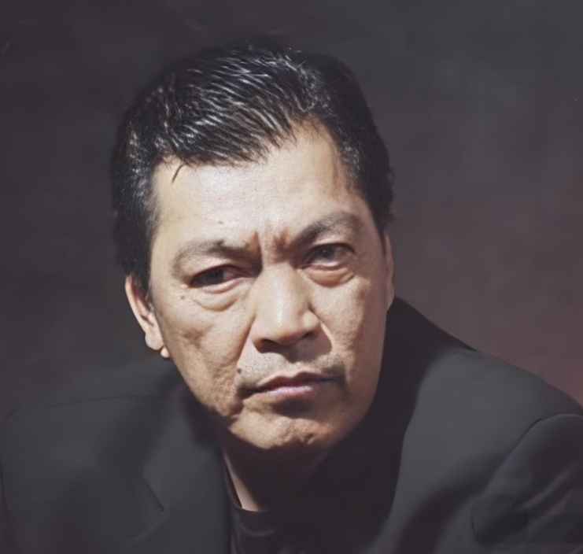

# 成奎安

- 姓名：成奎安
- 性别：男
- 国籍：中国（香港）
- 出生日期：1955年2月1日
- 去世日期：2009年8月27日
- 去世原因：鼻咽癌

# 生平简介

成奎安，香港著名演员，以饰演反派角色闻名，绰号"大傻"。2009年8月27日在香港逝世，享年54岁。

# 主要贡献

参演《监狱风云》《古惑仔》等大量电影，塑造深入人心的"大傻"形象，是港片黄金时代的标志性反派。

# 参考资料

- 百度百科链接：https://baike.baidu.com/item/%E6%88%90%E5%A5%8E%E5%AE%89
