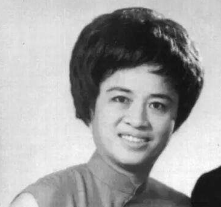

# 郑裕彤

- 姓名：郑裕彤
- 性别：男
- 国籍：中国（香港）
- 出生日期：1925年8月26日
- 去世日期：2016年9月29日
- 去世原因：因病医治无效

# 生平简介

郑裕彤，广东顺德人，香港著名企业家，新世界发展、周大福珠宝创办人。2016年9月29日在香港逝世，享年91岁。

# 主要贡献

创办新世界发展与周大福，业务涵盖地产、珠宝等，是香港顶级富豪，人称"珠宝大王"。

# 参考资料

- 百度百科链接：https://baike.baidu.com/item/%E9%83%91%E8%A3%95%E5%BD%A4
