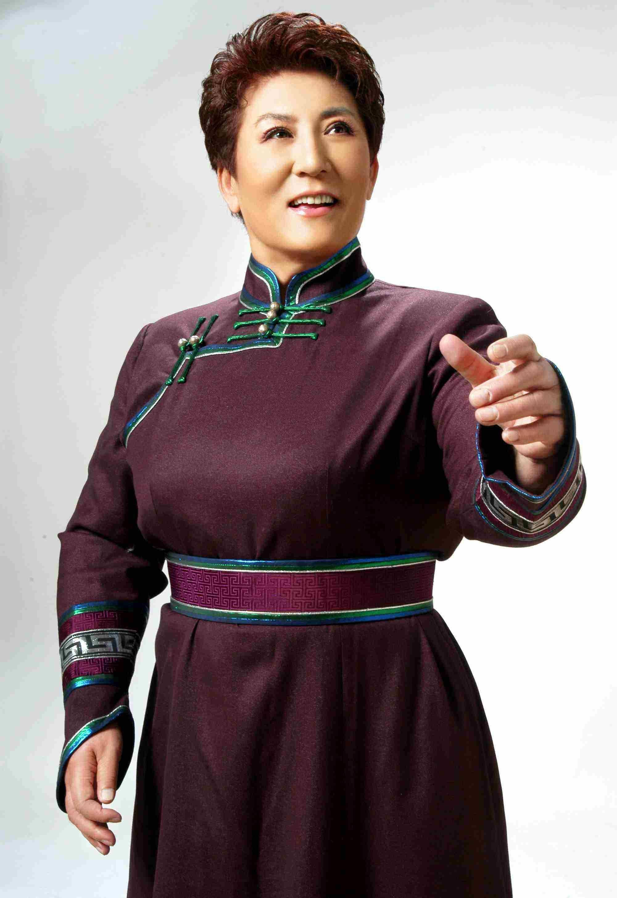

# 德德玛

- 姓名：德德玛
- 性别：女
- 国籍：中国
- 出生日期：1947年
- 去世日期：2023年11月28日
- 去世原因：多器官功能衰竭

# 生平简介

德德玛是蒙古族著名女中音歌唱家，出生于内蒙古额济纳旗。1960年加入乌兰牧骑开始歌唱生涯，1978年凭借《美丽的草原我的家》一举成名。1998年在日本演出时突发脑溢血，经过两年康复训练后重返舞台。她将长调民歌与美声唱法有机融合，形成了独特的演唱风格。

# 主要贡献

演唱《美丽的草原我的家》《草原夜色美》《父亲的草原母亲的河》等经典歌曲；获得"全国十大女歌唱家"第一名、蒙古国国家文化艺术最高奖等；创办内蒙古德德玛音乐艺术专修学院，培养少数民族音乐人才。

# 参考资料

- 百度百科链接：
