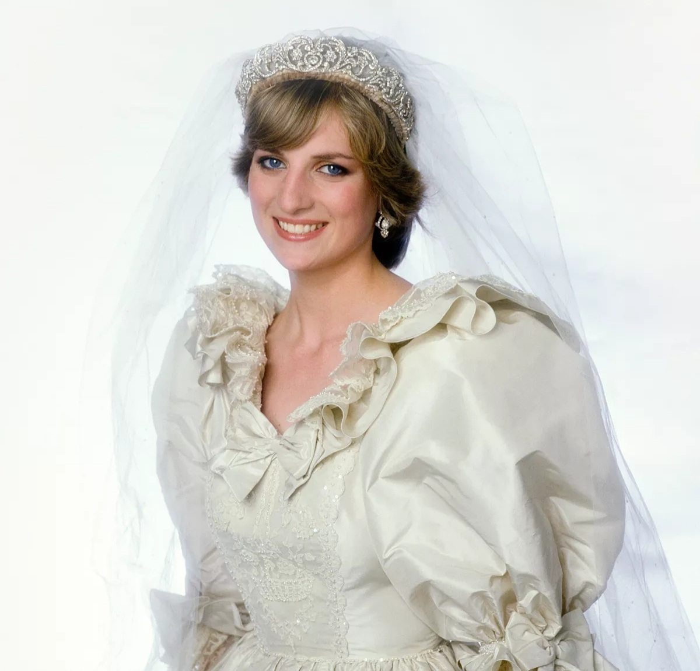

# 戴安娜王妃

- 姓名：戴安娜王妃
- 性别：女
- 国籍：英国
- 出生日期：1961年7月1日
- 去世日期：1997年8月31日
- 去世原因：车祸

# 生平简介

戴安娜王妃（Diana, Princess of Wales），出生于英国诺福克，英国查尔斯王子的第一任妻子。1981年与查尔斯王子结婚，成为威尔士王妃。她积极参与慈善事业，关注艾滋病患者和弱势群体。1996年与查尔斯王子离婚。1997年8月31日在巴黎遭遇车祸逝世，享年36岁。

# 主要贡献

戴安娜王妃是全球知名的慈善家，她致力于艾滋病防治、反地雷运动等公益事业。她的亲民形象和慈善工作赢得了全球人民的爱戴，被誉为"人民的王妃"。

# 参考资料

- 百度百科链接：https://m.baike.com/wiki/%E6%88%B4%E5%AE%89%E5%A8%9C%E7%8E%8B%E5%A6%83/355597