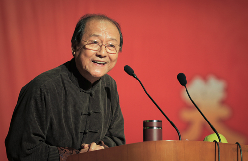

# 丁广泉

- 姓名：丁广泉
- 性别：男
- 国籍：中国
- 出生日期：1944年10月14日
- 去世日期：2018年1月18日
- 去世原因：肺癌

# 生平简介

丁广泉，河北承德人，回族，著名相声演员，侯宝林的第七位入室弟子。1964年毕业于北京回民学院，1973年正式拜师侯宝林。1985年因在相声电视剧《破财招灾》中饰演"二大伯"而成名。1989年开始培养外国笑星，先后培养了大山、卡尔罗、郝莲露等来自70多个国家的100多个洋弟子，被誉为"京城洋教头"。2018年1月18日因肺癌在北京逝世，享年73岁。

# 主要贡献

丁广泉是侯派相声传承人，为相声艺术的国际传播做出了重要贡献。他开创了"洋弟子"学说相声的先河，让中国相声走向世界。他创作了《发财有术》《生活的浪花》《新编孔乙己》等作品，曾获文化部创作表演二等奖、中国曲艺牡丹奖等荣誉。他在北京化工大学、北京语言大学等高校创办"快乐课堂"，免费教授相声，致力于文化传播和汉语推广。

# 参考资料

- 百度百科链接：https://m.baike.com/wiki/%E4%B8%81%E5%B9%BF%E6%B3%89/902315
