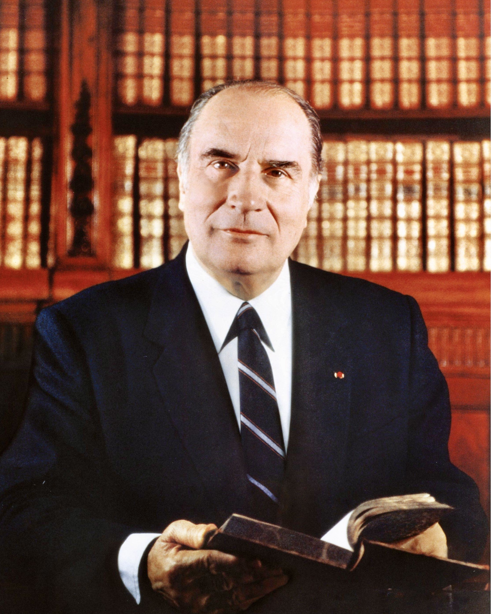

# 弗朗索瓦·密特朗（François Mitterrand）

- 姓名：弗朗索瓦·密特朗
- 性别：男
- 国籍：法国
- 出生日期：1916年10月26日
- 去世日期：1996年1月8日
- 去世原因：前列腺癌

# 生平简介

弗朗索瓦·密特朗，法国政治家，法国社会党领袖。1981年当选法国总统，1988年连任，执政长达14年，是法兰西第五共和国任职时间最长的总统。早年参加反法西斯抵抗运动，战后长期活跃于法国政坛。执政期间推动了广泛的社会改革和欧洲一体化进程。1996年1月8日在巴黎逝世。

# 主要贡献

废除死刑、推动权力下放改革、实施文化领域大型建设工程（卢浮宫金字塔、国家图书馆、巴士底歌剧院等）；推动欧洲一体化进程，与德国总理科尔共同促成《马斯特里赫特条约》签署，为欧洲联盟的建立奠定基础。

# 参考资料

- 百度百科链接：
