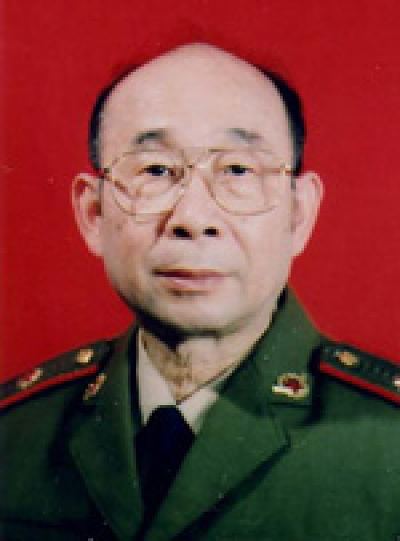

# 高伯龙

- 姓名：高伯龙
- 性别：男
- 国籍：中国
- 出生日期：1928年6月29日
- 去世日期：2017年12月6日
- 去世原因：因病逝世

# 生平简介

高伯龙，广西南宁人，中国激光物理专家，中国工程院院士，国防科技大学教授。1951年毕业于清华大学物理系，长期从事理论物理和激光技术研究。自20世纪70年代起，带领团队攻克激光陀螺关键技术，耗费四十余年研制出中国自主知识产权的激光陀螺。2017年12月6日在长沙逝世。

# 主要贡献

中国激光陀螺技术的奠基人和开拓者，带领团队打破国外技术封锁，研制出中国第一台激光陀螺仪；使中国成为世界上少数能独立研制高精度激光陀螺的国家；其成果广泛应用于中国航空航天、航海和战略武器导航领域；获多项国家科技进步奖。

# 参考资料

- 百度百科链接：
