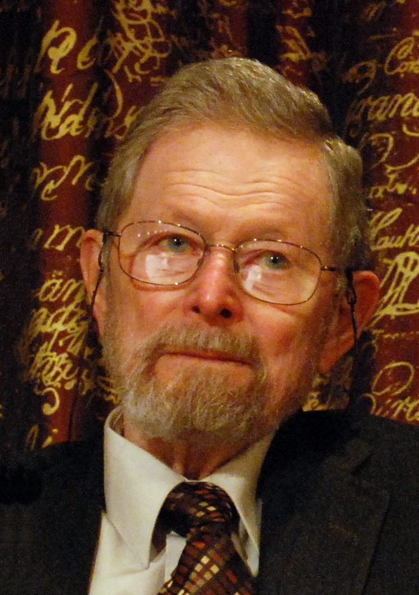

# George E. Smith

- 姓名：George E. Smith（乔治·E·史密斯）
- 性别：男
- 国籍：美国
- 出生日期：1930年
- 去世日期：2025年5月28日
- 去世原因：

# 生平简介

美国应用物理学家，曾在贝尔实验室工作。与Willard Boyle合作研究半导体器件期间，共同发明了电荷耦合器件（CCD），彻底改变了数字摄影和图像传感技术。

# 主要贡献

与Willard Boyle共同发明电荷耦合器件（CCD），奠定了数字摄影、天文观测、医学成像等技术的基础。2009年与Boyle以及光纤通信先驱高锟共同获得诺贝尔物理学奖。

# 参考资料

- 百度百科链接：
