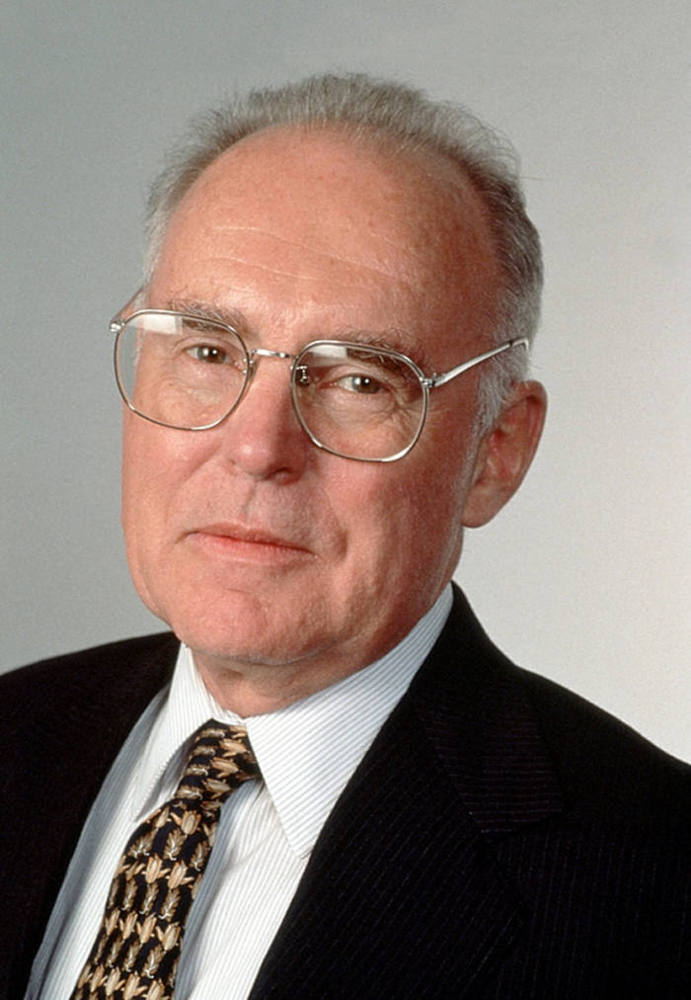

# 戈登·摩尔（Gordon Moore）

- 姓名：戈登·摩尔（Gordon Moore）
- 性别：男
- 国籍：美国
- 出生日期：1929年1月3日
- 去世日期：2023年3月24日
- 去世原因：自然衰老

# 生平简介

戈登·摩尔是英特尔公司联合创始人，出生于旧金山。毕业于加州大学伯克利分校和加州理工学院，获物理化学博士学位。1956年参与创建仙童半导体公司，1968年与鲍勃·诺伊斯共同创立英特尔。他提出的"摩尔定律"预测了集成电路上可容纳的晶体管数量每两年翻一番，成为半导体行业的指导原则。

# 主要贡献

联合创立英特尔公司；提出"摩尔定律"，成为半导体行业发展的重要预测；推动微电子技术发展；创立戈登与贝蒂·摩尔基金会，支持科学研究和环境保护。

# 参考资料

- 百度百科链接：https://baike.weixin.qq.com/v722034.htm
