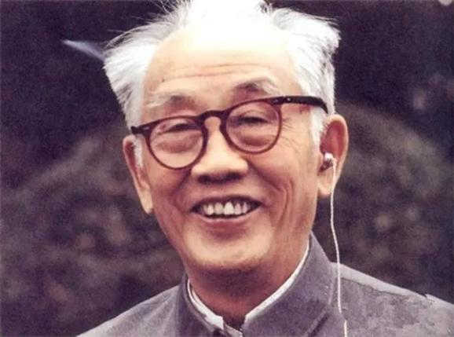

# 贺绿汀

- 姓名：贺绿汀
- 性别：男
- 国籍：中国
- 出生日期：1903年7月20日
- 去世日期：1999年4月27日
- 去世原因：因病逝世

# 生平简介

贺绿汀，出生于湖南邵阳，中国著名作曲家、音乐教育家。1931年考入上海国立音乐专科学校，1934年创作《牧童短笛》，获得亚历山大·齐尔品举办的"中国风味钢琴曲"比赛一等奖。他的代表作包括《游击队歌》《嘉陵江上》等。曾任上海音乐学院院长、中国音乐家协会副主席。1999年4月27日在上海逝世，享年96岁。

# 主要贡献

贺绿汀是中国现代音乐的重要奠基人，他的作品具有鲜明的民族风格和时代气息。《牧童短笛》是中国钢琴音乐的经典之作，《游击队歌》成为抗日战争时期的重要歌曲。他培养了大批音乐人才。

# 参考资料

- 百度百科链接：https://m.baike.com/wiki/%E8%B4%BA%E7%BB%BF%E6%B1%80/355591