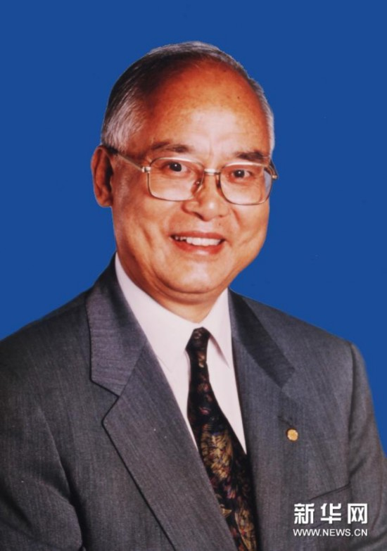

# 何振梁

- 姓名：何振梁
- 性别：男
- 国籍：中国
- 出生日期：1929年12月29日
- 去世日期：2015年1月4日
- 去世原因：因病医治无效

# 生平简介

何振梁，江苏无锡人，中国体育外交家。曾任国际奥委会副主席、中国奥委会主席。2015年1月4日在北京逝世，享年85岁。

# 主要贡献

为北京申办和举办2008年奥运会作出重大贡献，被誉为"中国申奥之父"。

# 参考资料

- 百度百科链接：https://baike.baidu.com/item/%E4%BD%95%E6%8C%AF%E6%A2%81
