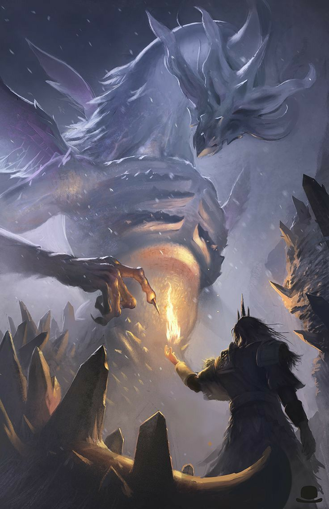

# 希斯·莱杰（Heath Ledger）

- 姓名：希斯·莱杰（Heath Ledger）
- 性别：男
- 国籍：澳大利亚
- 出生日期：1979年4月4日
- 去世日期：2008年1月22日
- 去世原因：急性药物中毒

# 生平简介

希斯·莱杰，澳大利亚演员。2008年1月22日在纽约去世，享年28岁。

# 主要贡献

凭《断背山》获奥斯卡最佳男主角提名，在《蝙蝠侠：黑暗骑士》中塑造"小丑"，去世后获奥斯卡最佳男配角奖。

# 参考资料

- 百度百科链接：https://baike.baidu.com/item/%E5%B8%8C%E6%96%AF%C2%B7%E8%8E%B1%E6%9D%B0
