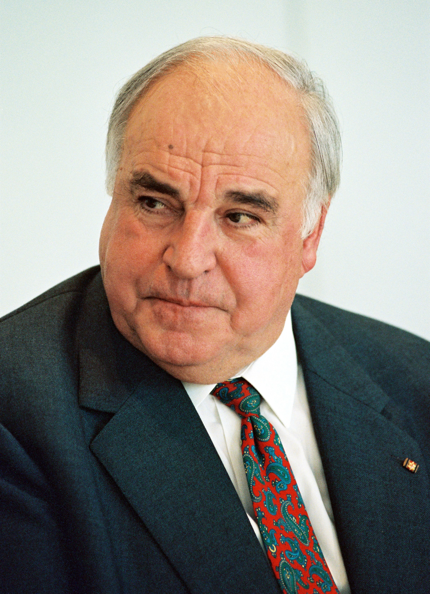

# 科尔（Helmut Kohl）

- 姓名：科尔（Helmut Kohl）
- 性别：男
- 国籍：德国
- 出生日期：1930年4月3日
- 去世日期：2017年6月16日
- 去世原因：因病医治无效

# 生平简介

赫尔穆特·科尔，德国政治家，生于莱茵兰-普法尔茨州路德维希港。1982年至1998年任联邦德国总理，是德国在任时间最长的总理。2017年6月16日在路德维希港逝世，享年87岁。

# 主要贡献

推动两德统一，被誉为"统一之父"；推动欧洲一体化进程，为欧元创立作出重要贡献。

# 参考资料

- 百度百科链接：https://baike.baidu.com/item/%E7%A7%91%E5%B0%94
