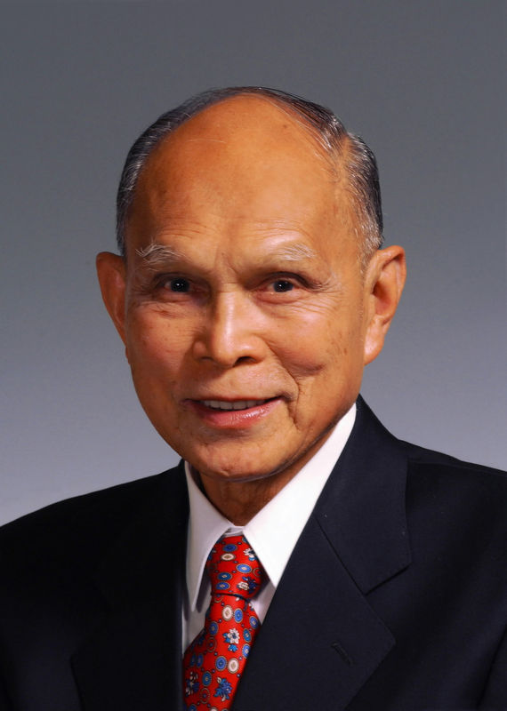

# 霍英东

- 姓名：霍英东
- 性别：男
- 国籍：中国（香港）
- 出生日期：1923年5月10日
- 去世日期：2006年10月28日
- 去世原因：因病医治无效

# 生平简介

霍英东，广东番禺人，香港著名爱国实业家。早年创业，涉足航运、地产等。2006年10月28日在北京逝世，享年84岁。

# 主要贡献

创办霍英东集团；改革开放后率先投资内地，捐资兴建学校、医院等，获颁国家荣誉。

# 参考资料

- 百度百科链接：https://baike.baidu.com/item/%E9%9C%8D%E8%8B%B1%E4%B8%9C
