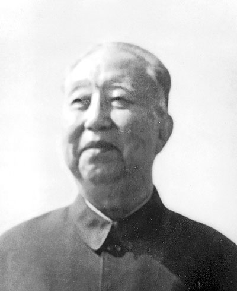

# 华国锋

- 姓名：华国锋
- 性别：男
- 国籍：中国
- 出生日期：1921年2月16日
- 去世日期：2008年8月20日
- 去世原因：因病医治无效

# 生平简介

华国锋，山西交城人，中国共产党的优秀党员。1938年参加革命工作并加入中国共产党。曾任湖南省委第一书记、国务院副总理兼公安部部长。1976年任中共中央主席、国务院总理、中央军委主席。2008年8月20日在北京逝世，享年87岁。

# 主要贡献

在特殊历史时期主持党和国家工作，粉碎"四人帮"后稳定了局势；支持开展真理标准问题讨论，为实现工作重心转移创造条件。

# 参考资料

- 百度百科链接：https://baike.baidu.com/item/%E5%8D%8E%E5%9B%BD%E9%94%8B
