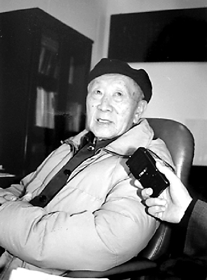

# 黄昆

- 姓名：黄昆
- 性别：男
- 国籍：中国
- 出生日期：1919年9月2日
- 去世日期：2005年7月6日
- 去世原因：因病医治无效

# 生平简介

黄昆，浙江嘉兴人，中国物理学家，中国科学院院士。1941年毕业于燕京大学，获英国布里斯托大学博士。曾任北京大学教授、中国科学院半导体研究所所长。2005年7月6日在北京逝世，享年86岁。

# 主要贡献

提出"黄方程"和"黄散射"理论，奠定中国固体物理学基础；获2001年国家最高科学技术奖。

# 参考资料

- 百度百科链接：https://baike.baidu.com/item/%E9%BB%84%E6%98%86
