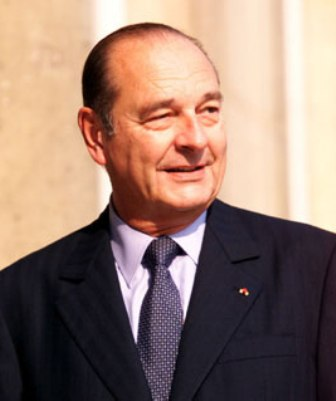

# 希拉克（Jacques Chirac）

- 姓名：希拉克（Jacques Chirac）
- 性别：男
- 国籍：法国
- 出生日期：1932年11月29日
- 去世日期：2019年9月26日
- 去世原因：自然衰老

# 生平简介

雅克·希拉克，法国政治家，生于巴黎。1995年至2007年任法国总统，此前曾两次出任总理、任巴黎市长。2019年9月26日在巴黎逝世，享年86岁。

# 主要贡献

推动欧洲一体化，反对伊拉克战争；重视发展中法关系，推动法国对外政策独立自主。

# 参考资料

- 百度百科链接：https://baike.baidu.com/item/%E5%B8%8C%E6%8B%89%E5%85%8B
