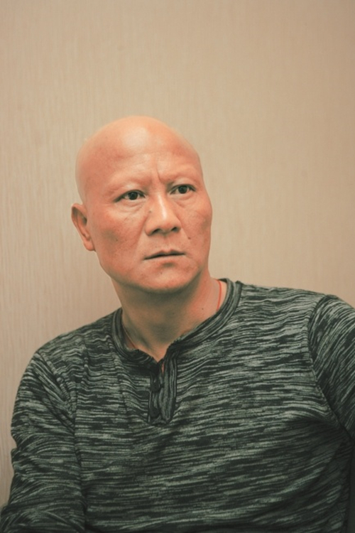

# 计春华

- 姓名：计春华
- 性别：男
- 国籍：中国
- 出生日期：1961年7月20日
- 去世日期：2018年7月11日
- 去世原因：肺癌

# 生平简介

计春华是中国内地著名男演员、武术家，出生于浙江杭州。9岁开始习武，1982年因出演电影《少林寺》中的"秃鹰"一角被观众熟知。他以饰演反派角色闻名，光头形象深入人心。2018年因病去世。

# 主要贡献

参演《少林寺》《红高粱》《新少林五祖》《天龙八部》《连城诀》等影视作品；2016年获中国动作电影贡献奖；塑造了秃鹰、段延庆、血刀老祖等经典反派角色，对中国动作电影发展有重要贡献。

# 参考资料

- 百度百科链接：
