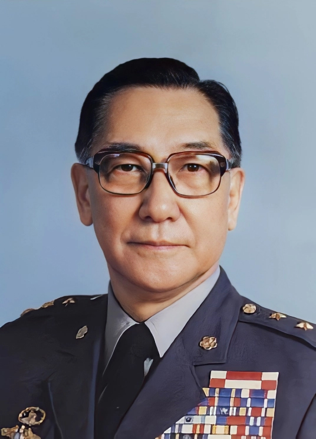

# 蒋纬国

- 姓名：蒋纬国
- 性别：男
- 国籍：中国
- 出生日期：1916年10月6日
- 去世日期：1997年9月22日
- 去世原因：因病逝世

# 生平简介

蒋纬国，浙江奉化人，早年由蒋介石收养为次子。曾在德国慕尼黑军校留学，受过严格的德国军事教育。回中国后加入国民党军队，历任装甲兵司令等职。1949年随国民党迁台，在台湾历任三军大学校长、国防部联合作战训练部主任等军职。晚年公开谈论两岸统一议题。1997年9月22日在台北逝世。

# 主要贡献

早年将德国军事训练体系引入中国装甲兵建设；长期致力于台湾军事教育体系的建立和完善；晚年积极推动两岸交流，倡导和平统一。

# 参考资料

- 百度百科链接：
