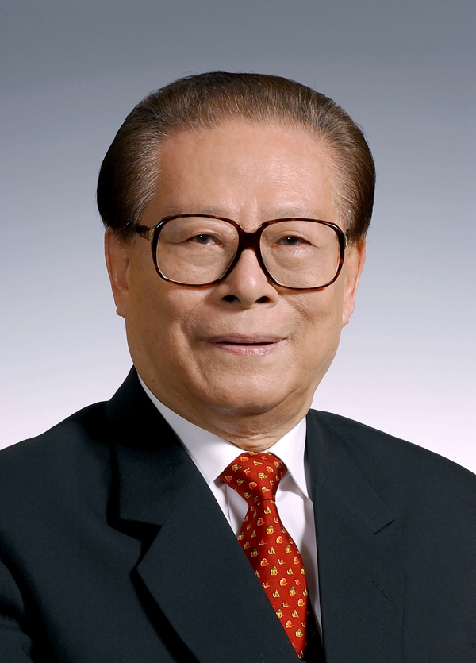

# 江泽民

- 姓名：江泽民
- 性别：男
- 国籍：中国
- 出生日期：1926年8月17日
- 去世日期：2022年11月30日
- 去世原因：患白血病合并多脏器功能衰竭

# 生平简介

江泽民，江苏扬州人，中国共产党的杰出领导人，党和国家的卓越领导人。1946年加入中国共产党，1947年毕业于上海交通大学电机系。曾长期在机械工业领域工作，1985年任上海市市长，1987年任上海市委书记。1989年当选中共中央总书记，1993年至2003年任国家主席，同时任中央军委主席。2022年11月30日12时13分在上海逝世，享年96岁。

# 主要贡献

主持中国改革开放关键时期的党和国家工作，推动建立社会主义市场经济体制，提出"三个代表"重要思想；领导中国加入世界贸易组织，推动香港、澳门回归后的繁荣稳定。

# 参考资料

- 百度百科链接：https://baike.baidu.com/item/%E6%B1%9F%E6%B3%BD%E6%B0%91
