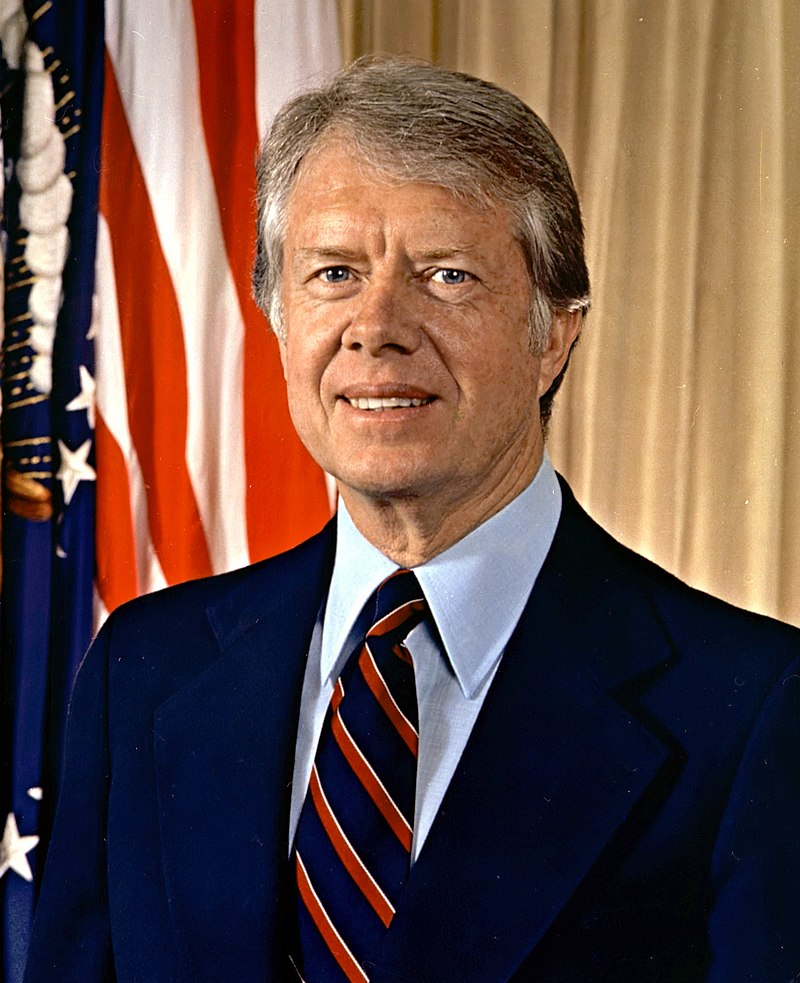

# 吉米·卡特（Jimmy Carter）

- 姓名：吉米·卡特（Jimmy Carter）
- 性别：男
- 国籍：美国
- 出生日期：1924年10月1日
- 去世日期：2024年12月29日
- 去世原因：自然衰老

# 生平简介

吉米·卡特是美国第39任总统，出生于佐治亚州普兰斯。毕业于美国海军学院，曾在潜艇部队服役。1977-1981年担任美国总统，任内推动中美建交、促成埃以和平协议。卸任后创立卡特中心，致力于促进世界和平与人道主义事业。2002年获得诺贝尔和平奖。2024年成为美国历史上首位百岁前总统，同年12月去世。

# 主要贡献

促成1979年中美建交；促成埃及和以色列签署戴维营协议；推动巴拿马运河主权归还；创立卡特中心促进全球和平与人权；获得诺贝尔和平奖。

# 参考资料

- 百度百科链接：https://baike.weixin.qq.com/v34464.htm
