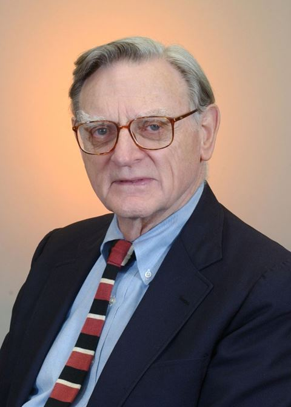

# 古迪纳夫（John B. Goodenough）

- 姓名：古迪纳夫（John B. Goodenough）
- 性别：男
- 国籍：美国
- 出生日期：1922年7月25日
- 去世日期：2023年6月25日
- 去世原因：自然衰老

# 生平简介

约翰·古迪纳夫，美国物理学家、材料科学家。生于德国耶拿，先后就读耶鲁大学、芝加哥大学，长期任教于得克萨斯大学奥斯汀分校。2023年6月25日在奥斯汀逝世，享年100岁。

# 主要贡献

发明钴酸锂、磷酸铁锂等锂离子电池关键材料，被誉为"锂电池之父"；获2019年诺贝尔化学奖（时年97岁，为最年长获奖者）。

# 参考资料

- 百度百科链接：https://baike.baidu.com/item/%E5%8F%A4%E8%BF%AA%E7%BA%B3%E5%A4%AB
