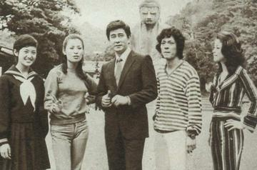

# 宇津井健（大岛茂扮演者）

- 姓名：宇津井健
- 性别：男
- 国籍：日本
- 出生日期：1931年10月24日
- 去世日期：2014年3月14日
- 去世原因：慢性呼吸不全

# 生平简介

宇津井健，出生于日本东京，日本知名男演员。早稻田大学文学系演剧专业肄业，1952年考入演员剧团培训班"俳优座养成所"。1953年在中川信夫导演的《思春泉》中完成银幕首秀，1954年加入新东宝电影制片厂。1961年转战大映电影公司，成为大映电视剧部门的台柱子。1975年至1976年，因在日本电视剧《血疑》中饰演女主角的父亲大岛茂一角，成为日本家喻户晓的"国民父亲"。该剧在中国播出后引起巨大轰动，宇津井健也因此成为中国观众最熟悉的日本演员之一。他从艺60年，拍摄电影达127部。2014年3月14日因慢性呼吸不全去世，享年82岁。

# 主要贡献

宇津井健是日本影视界的代表性人物，他在《血疑》中塑造的大岛茂形象深入人心，被誉为银屏上的"国民父亲"。该角色展现了父爱的伟大与深沉，成为中日文化交流的重要纽带。他获得过第三届大众电视金鹰奖最佳外国男主角奖项。他长达60年的演艺生涯见证了日本电影和电视剧的黄金时代，为日本影视艺术的发展做出了重要贡献。

# 参考资料

- 百度百科链接：https://m.baike.com/wiki/%E5%AE%87%E6%B4%A5%E4%BA%95%E5%81%A5
