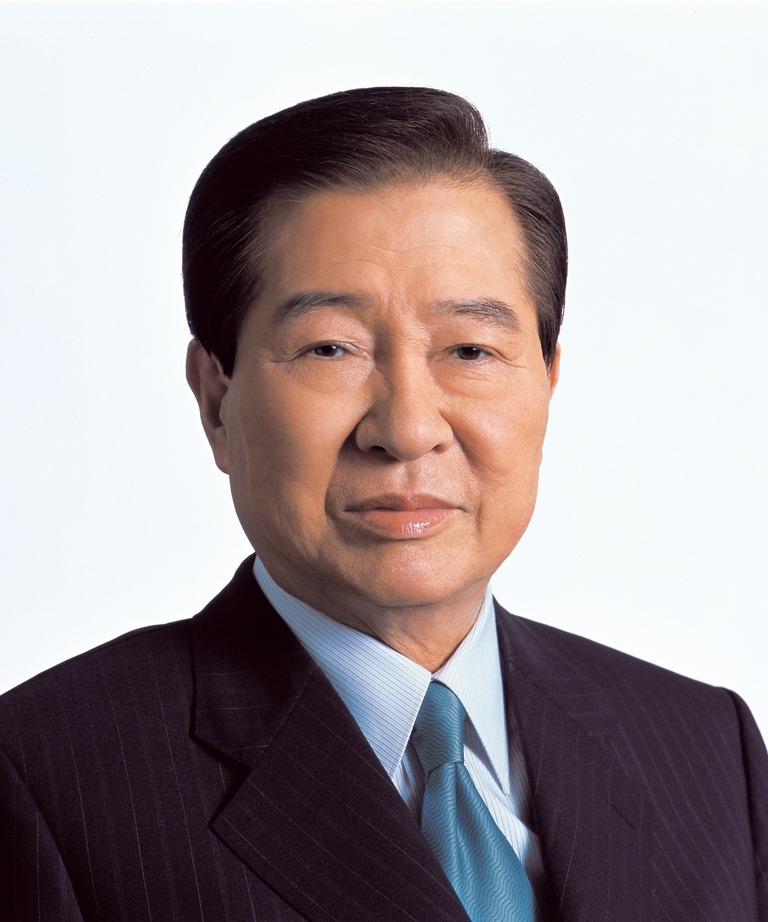

# 金大中（Kim Dae-jung）

- 姓名：金大中（Kim Dae-jung）
- 性别：男
- 国籍：韩国
- 出生日期：1924年1月6日
- 去世日期：2009年8月18日
- 去世原因：因病医治无效

# 生平简介

金大中，韩国政治家，生于全罗南道。1998年至2003年任韩国总统。2009年8月18日在首尔逝世，享年85岁。

# 主要贡献

推行对朝"阳光政策"，2000年实现朝韩首脑会晤，获2000年诺贝尔和平奖。

# 参考资料

- 百度百科链接：https://baike.baidu.com/item/%E9%87%91%E5%A4%A7%E4%B8%AD
