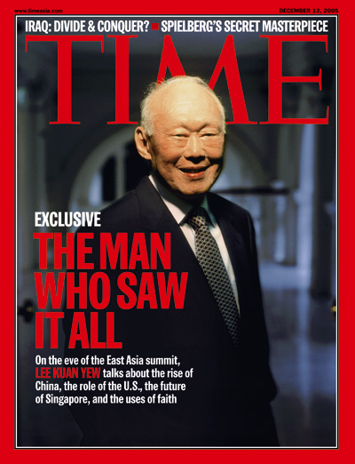

# 李光耀（Lee Kuan Yew）

- 姓名：李光耀（Lee Kuan Yew）
- 性别：男
- 国籍：新加坡
- 出生日期：1923年9月16日
- 去世日期：2015年3月23日
- 去世原因：因病医治无效

# 生平简介

李光耀，新加坡政治家，新加坡开国总理。祖籍广东大埔，生于新加坡，毕业于剑桥大学。1959年至1990年任新加坡总理，被誉为"新加坡国父"。2015年3月23日在新加坡逝世，享年91岁。

# 主要贡献

领导新加坡从殖民地独立并发展成现代化发达国家，开创"新加坡模式"，推动经济腾飞和城市治理。

# 参考资料

- 百度百科链接：https://baike.baidu.com/item/%E6%9D%8E%E5%85%89%E8%80%80
