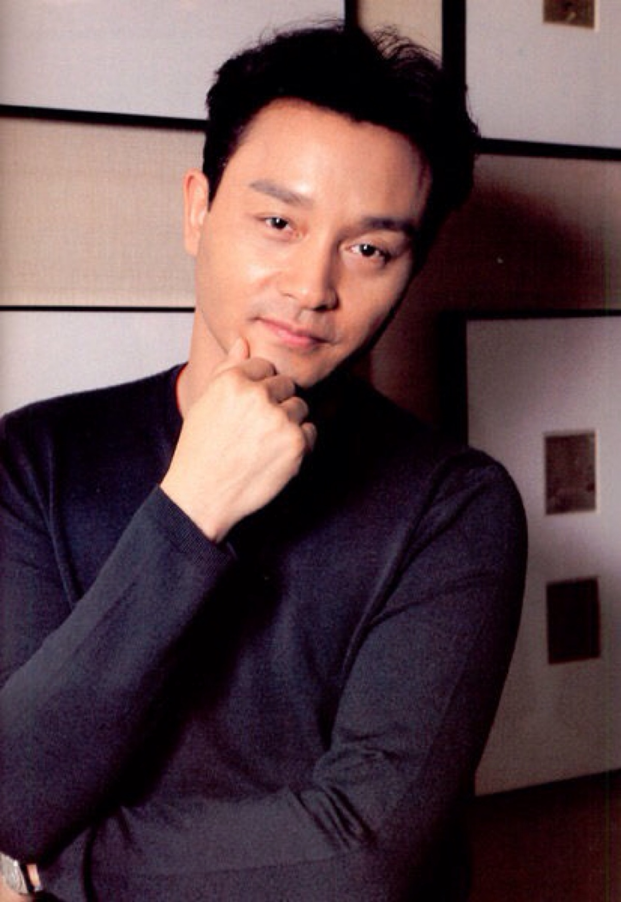

# 张国荣

- 姓名：张国荣
- 性别：男
- 国籍：中国
- 出生日期：1956年9月12日
- 去世日期：2003年4月1日
- 去世原因：抑郁症跳楼自杀

# 生平简介

张国荣，出生于香港，中国香港著名歌手、演员。1977年参加亚洲歌唱大赛出道，1983年凭借《风继续吹》成名。他主演了《英雄本色》《倩女幽魂》《霸王别姬》等经典影片。1993年凭借《霸王别姬》获得戛纳国际电影节最佳男演员提名。2003年4月1日因抑郁症在香港逝世，享年46岁。

# 主要贡献

张国荣是香港娱乐圈的传奇人物，被誉为"哥哥"。他的音乐和电影作品影响了一代观众，《沉默是金》《当年情》等歌曲成为经典。他主演的《霸王别姬》成为中国电影史上的里程碑作品。

# 参考资料

- 百度百科链接：https://m.baike.com/wiki/%E5%BC%A0%E5%9B%BD%E8%8D%A3/355635