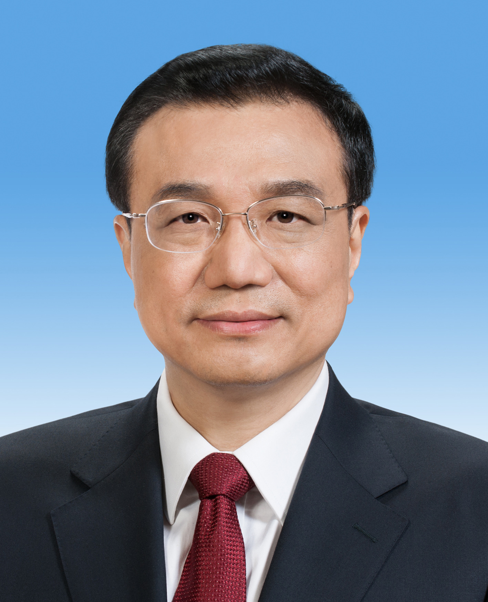

# 李克强

- 姓名：李克强
- 性别：男
- 国籍：中国
- 出生日期：1955年7月1日
- 去世日期：2023年10月27日
- 去世原因：突发心脏病，经全力抢救无效

# 生平简介

李克强，安徽定远人，中国共产党的优秀党员，党和国家的卓越领导人。1976年加入中国共产党，北京大学法律系毕业。曾任共青团中央第一书记、河南省委书记、辽宁省委书记。2008年任国务院副总理，2013年3月至2023年3月任国务院总理。2023年10月27日0时10分在上海逝世，享年68岁。

# 主要贡献

任国务院总理期间推动简政放权、大众创业万众创新，提出"互联网+"行动；推进新型城镇化和脱贫攻坚，深化供给侧结构性改革。

# 参考资料

- 百度百科链接：https://baike.baidu.com/item/%E6%9D%8E%E5%85%8B%E5%BC%BA
