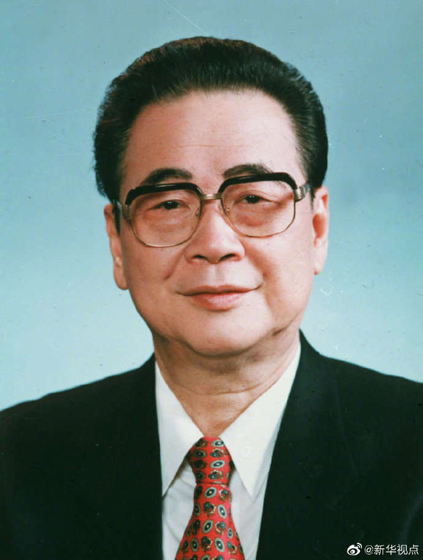

# 李鹏

- 姓名：李鹏
- 性别：男
- 国籍：中国
- 出生日期：1928年10月20日
- 去世日期：2019年7月22日
- 去世原因：因病医治无效

# 生平简介

李鹏，四川成都人，中国共产党的优秀党员，党和国家的卓越领导人。1945年加入中国共产党，1948年赴苏联留学，1955年毕业于莫斯科动力学院水力发电系。回国后长期从事电力工业领导工作，1988年至1998年任国务院总理。2019年7月22日在北京逝世，享年91岁。

# 主要贡献

任国务院总理期间主持电力、能源工业发展，推动三峡工程开工建设；参与制定国民经济和社会发展规划，为改革开放和现代化建设作出重要贡献。

# 参考资料

- 百度百科链接：https://baike.baidu.com/item/%E6%9D%8E%E9%B9%8F
