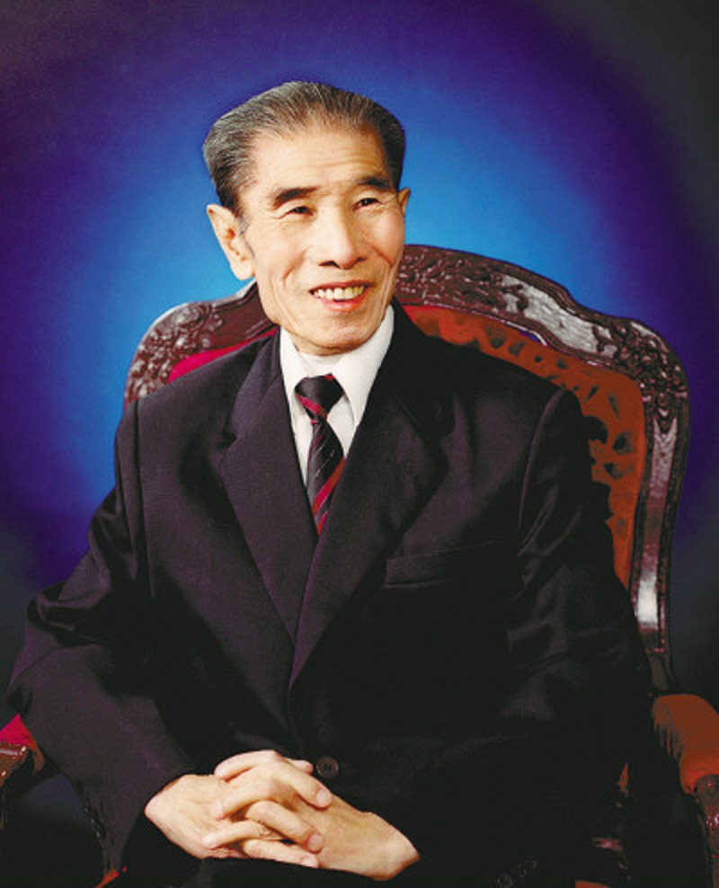

# 李文华

- 姓名：李文华
- 性别：男
- 国籍：中国
- 出生日期：1927年7月
- 去世日期：2009年5月9日
- 去世原因：喉癌致肺源性心脏病

# 生平简介

李文华，出生于北京，中国著名相声演员。1956年加入中国铁路文工团，开始相声表演生涯。他与姜昆合作表演了《如此照相》《看电视》《祖爷爷的烦恼》等经典相声作品。他的表演风格幽默风趣，善于刻画人物。2009年5月9日因喉癌逝世，享年82岁。

# 主要贡献

李文华是中国相声界的重要演员，他与姜昆的合作成为相声史上的经典组合。他的作品贴近生活，反映社会现实，深受观众喜爱。他为相声艺术的发展做出了贡献。

# 参考资料

- 百度百科链接：https://m.baike.com/wiki/%E6%9D%8E%E6%96%87%E5%8D%8E/661086