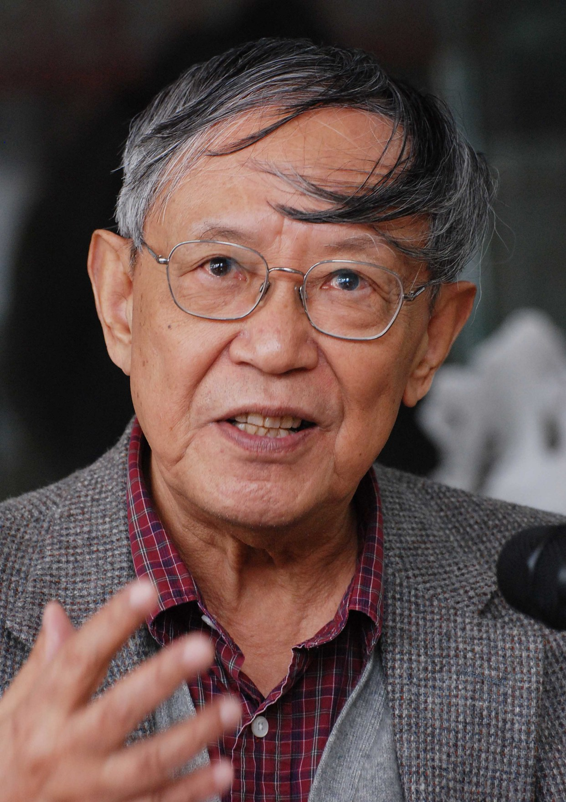

# 李泽厚

- 姓名：李泽厚
- 性别：男
- 国籍：中国
- 出生日期：1930年6月13日
- 去世日期：2021年11月3日
- 去世原因：自然衰老

# 生平简介

李泽厚，1930年6月13日出生于湖南长沙，中国当代著名哲学家、美学家、思想史家。1954年毕业于北京大学哲学系，先后在中国社会科学院哲学研究所、中国社会科学院近代史研究所从事研究工作。他是20世纪80年代中国"美学热"和"文化热"的核心人物，其思想深刻影响了改革开放后中国知识界的精神面貌。

李泽厚的学术生涯跨越哲学、美学、思想史三大领域，著有《美的历程》、《中国近代思想史论》、《中国古代思想史论》、《中国现代思想史论》、《批判哲学的批判》、《华夏美学》、《论语今读》等大量重要著作。1992年旅居美国，先后在多所大学任教。他的"实践美学"和"情本体"理论独树一帜，是中国当代最具原创性的思想家之一。2021年11月3日，李泽厚在美国科罗拉多州逝世，享年91岁。

# 主要贡献

李泽厚最重要的贡献在于构建了中国现代美学和思想史的理论体系。他的《美的历程》以独特的视角梳理了中国数千年艺术与美学发展脉络，成为改革开放初期最具影响力的学术畅销书之一。他的"中国思想史三论"（古代、近代、现代）系统阐述了中国思想从传统到现代的转型历程，提出了"救亡压倒启蒙"、"西体中用"等具有深远影响的学术命题。

李泽厚的"实践美学"在马克思主义实践论基础上吸收康德、皮亚杰等西方思想资源，提出"积淀"说，认为人类审美心理结构是历史实践长期积淀的产物。晚年的"情本体"理论将中国传统文化的情感哲学提升为现代人生哲学的核心概念。他还提出了"乐感文化"与"实用理性"等概念来描述中国文化心理结构，成为中国哲学社会科学的重要理论资源。

# 参考资料

- 百度百科链接：https://m.baike.com/wiki/李泽厚
