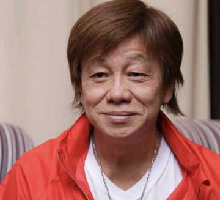

# 梁小龙

- 姓名：梁小龙
- 性别：男
- 国籍：中国（香港）
- 出生日期：1951年8月9日
- 去世日期：2026年1月14日
- 去世原因：心衰竭

# 生平简介

梁小龙，出生于广东中山，中国香港男演员、武术家、武打明星。成长于香港贫寒家庭，15岁进入武行做替身演员。1972年被香港电影协会主席吴思远发掘进入演艺圈。1970年代与李小龙、成龙、狄龙合称"香港演艺圈四小龙"。1980年代在电视剧《大侠霍元甲》《陈真》中饰演民族英雄陈真，风靡中国大陆。2004年在周星驰电影《功夫》中饰演"火云邪神"深入人心。曾获"最佳动作男演员"奖、加拿大Fantasia国际电影节"传奇功夫巨星"奖。2026年1月14日因心衰竭逝世，享年75岁。

# 主要贡献

梁小龙是香港功夫电影的重要代表人物，硬桥硬马的真功夫风格独树一帜。他在《大侠霍元甲》《陈真》中塑造的陈真形象成为一代中国人的集体记忆。在《功夫》中饰演的火云邪神成为影史经典反派角色。他参演了《射雕英雄传》《神雕侠侣》《四大名捕》等多部影视作品，对香港动作电影和功夫文化的传播做出了重要贡献。

# 参考资料

- 百度百科链接：https://m.baike.com/wiki/%E6%A2%81%E5%B0%8F%E9%BE%99
