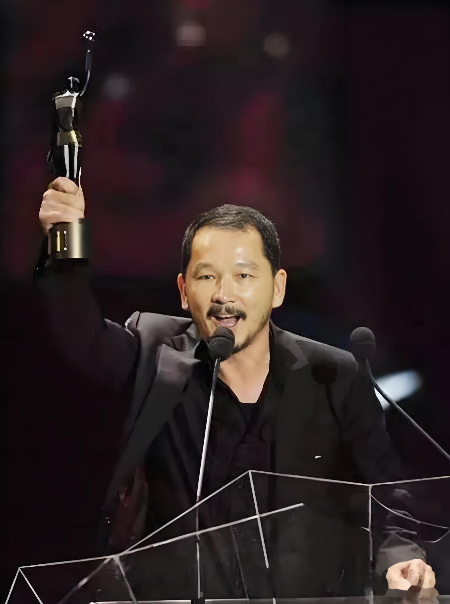

# 廖启智

- 姓名：廖启智
- 性别：男
- 国籍：中国（香港）
- 出生日期：1954年4月7日
- 去世日期：2021年3月28日
- 去世原因：胃癌

# 生平简介

廖启智，香港著名演员。1979年进入演艺圈，从影四十余年。2021年3月28日在香港逝世，享年66岁。

# 主要贡献

参演《无间道》《上海滩》等大量影视作品，多次获金像奖最佳男配角，是香港影坛实力派代表。

# 参考资料

- 百度百科链接：https://baike.baidu.com/item/%E5%BB%96%E5%90%AF%E6%99%BA
