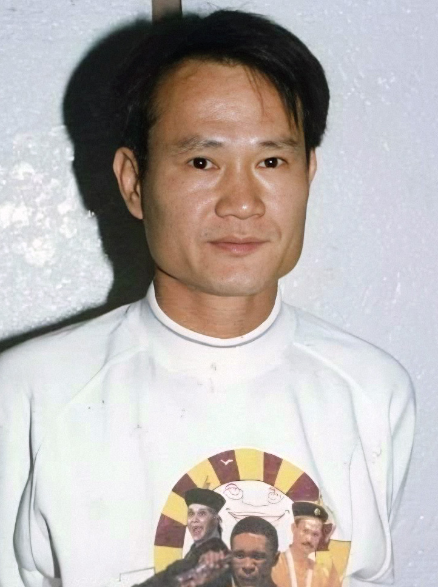

# 林正英

- 姓名：林正英
- 性别：男
- 国籍：中国（香港）
- 出生日期：1952年12月27日
- 去世日期：1997年11月8日
- 去世原因：肝癌

# 生平简介

林正英，香港著名演员、武术指导。早年师从京剧名家，后进入电影界，曾任李小龙的武术指导。1997年11月8日在香港逝世，享年45岁。

# 主要贡献

主演《僵尸先生》系列，塑造经典"僵尸道长"形象，开创香港僵尸片潮流，成为一代人的银幕记忆。

# 参考资料

- 百度百科链接：https://baike.baidu.com/item/%E6%9E%97%E6%AD%A3%E8%8B%B1
