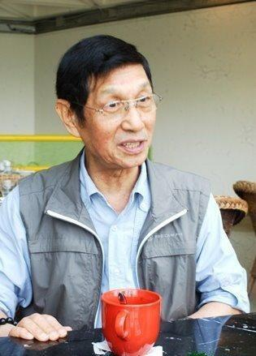

# 刘洵

- 姓名：刘洵
- 性别：男
- 国籍：中国（香港）
- 出生日期：1939年4月10日
- 去世日期：2026年5月29日
- 去世原因：自然衰老

# 生平简介

刘洵，出生于北京市，毕业于中国戏曲学院，中国香港男演员、香港演艺学院荣誉院士，别称"千面如来"。六岁起学习京剧表演，1958年被分配至中国京剧院任教长达20余年。1980年辞去工作前往香港发展，出任香港演艺学院讲师。1986年被聘为电影《刀马旦》戏曲指导并参演其中，正式踏入演艺圈。此后参演《笑傲江湖》《新龙门客栈》《九品芝麻官》等50余部影视作品，被誉为"最佳黄金配角"。1990年凭借《笑傲江湖》获得第10届香港电影金像奖最佳男配角提名。进入21世纪后，因身体原因鲜少拍戏，主要专注于舞台戏曲的改编及导演，全心任职于香港演艺学院。2021年获颁香港演艺学院荣誉院士。2026年5月29日下午6时离世，享年87岁。

# 主要贡献

刘洵是香港影坛重要的黄金配角演员，以精湛的戏曲功底和深厚的表演功底著称。他参演影视作品50余部，在《笑傲江湖》中饰演的古公公、《新龙门客栈》中的太监首领、《九品芝麻官》中的李公公等反派角色深入人心，被影迷称为"千面如来"。他将京剧表演艺术融入电影表演，为香港电影中的反派角色塑造贡献了独特风格。此外，他在香港演艺学院执教多年，致力于戏曲教育的传承与推广。

# 参考资料

- 百度百科链接：https://m.baike.com/wiki/%E5%88%98%E6%B4%B5
