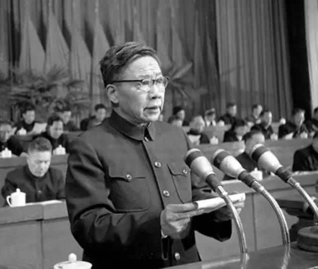

# 陆定一

- 姓名：陆定一
- 性别：男
- 国籍：中国
- 出生日期：1906年6月9日
- 去世日期：1996年5月9日
- 去世原因：因病逝世

# 生平简介

陆定一，江苏无锡人，中国共产党的重要领导人、宣传家。1925年加入中国共产党，参加长征。新中国成立后长期担任中共中央宣传部部长（1945-1952、1954-1966），是中共宣传和意识形态工作的重要负责人。文革期间遭受迫害，1979年平反恢复工作，后任全国政协副主席等职。1996年5月9日在北京逝世。

# 主要贡献

长期领导党的宣传和意识形态工作，提出"双百方针"等重要文化政策思想；参与起草多项党的重大文献；著有《老山界》等长征回忆作品。

# 参考资料

- 百度百科链接：
