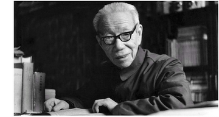

# 吕叔湘

- 姓名：吕叔湘
- 性别：男
- 国籍：中国
- 出生日期：1904年12月24日
- 去世日期：1998年4月9日
- 去世原因：病逝

# 生平简介

吕叔湘，江苏丹阳人，中国语言学家、语文教育家。1926年毕业于国立东南大学外国语文系，1936年考取公费赴英国留学。1938年回国，先后任云南大学文史系副教授、华西协合大学中国文化研究所研究员、金陵大学中国文化研究所研究员兼中央大学教授、清华大学教授、中国科学院语言研究所研究员。1955年入选中国科学院哲学社会科学部委员（院士），1980年受聘为美国语言学会名誉会员，1987年获授香港中文大学荣誉文学博士学位，1994年被选为俄罗斯科学院外籍院士。曾任中国科学院语言研究所所长、名誉所长，中国语言学会会长。1998年病逝于北京，享年94岁。

# 主要贡献

吕叔湘是中国近代汉语研究的拓荒者和奠基人，是20世纪最有影响力的语言学家之一。主要著作有《中国文法要略》《语法修辞讲话》（与朱德熙合著）《汉语语法论文集（增订本）》等，是《现代汉语词典》的前期主编。他直接主持和参与了国家许多重大语文活动和语文工作计划的制订，曾任中国文字改革委员会成员、中央推广普通话工作委员会委员、《中国语文》杂志主编、人民教育出版社副总编辑、全国中学语文教学研究会会长、语文出版社社长。他还是中华人民共和国第一部宪法起草委员会的语文顾问、人大法制委员会委员和中央文献研究室顾问。为纪念其贡献，中国社会科学院青年语言学家奖更名为"中国社会科学院吕叔湘语言学奖"。

# 参考资料

- 百度百科链接：https://m.baike.com/wiki/%E5%90%95%E5%8F%94%E6%B9%98
