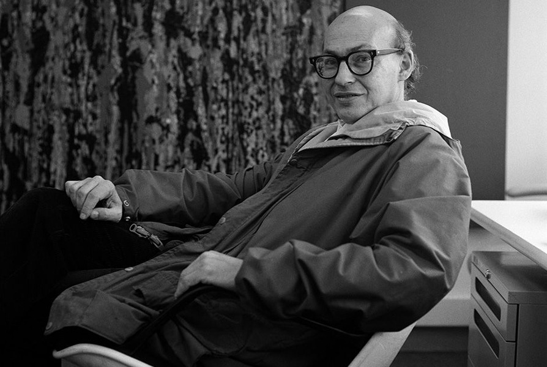

# 马文·明斯基

- 姓名：Marvin Minsky（马文·明斯基）
- 性别：男
- 国籍：美国
- 出生日期：1927年8月9日
- 去世日期：2016年1月24日
- 去世原因：脑溢血

# 生平简介

出生于美国纽约，数学家、计算机科学家，框架理论创立者，被誉为"人工智能之父"。高中毕业后进入美国海军服役，退伍后前往哈佛大学深造。1950年进入普林斯顿大学攻读数学博士学位。1951年设计制造了第一台随机连接神经网络学习机SNARC。1956年与约翰·麦卡锡等人发起组织了人工智能起点的"达特茅斯会议"。1959年与麦卡锡在麻省理工学院创立了世界第一个人工智能实验室。1969年被授予图灵奖，是第一位获此殊荣的人工智能学者。1985年成为MIT媒体实验室创始成员。

# 主要贡献

人工智能领域奠基人之一，发起达特茅斯会议开创AI学科。创立框架理论，出版《情感机器》《心智社会》等著作。在神经网络、认知科学、机器人学等领域均有奠基性贡献。1991年获IJCAI杰出研究奖，2001年获富兰克林奖章。

# 参考资料

- 百度百科链接：https://www.baike.com/wiki/%E9%A9%AC%E6%96%87%C2%B7%E6%98%8E%E6%96%AF%E5%9F%BA
