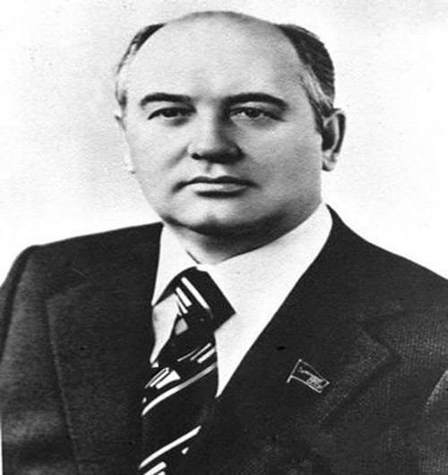

# 戈尔巴乔夫（Mikhail Gorbachev）

- 姓名：戈尔巴乔夫（Mikhail Gorbachev）
- 性别：男
- 国籍：苏联
- 出生日期：1931年3月2日
- 去世日期：2022年8月30日
- 去世原因：长期病痛后逝世

# 生平简介

米哈伊尔·戈尔巴乔夫，苏联政治家，苏联最后一任领导人。1955年毕业于莫斯科大学法律系。1985年任苏共中央总书记，1990年至1991年任苏联总统。2022年8月30日在莫斯科逝世，享年91岁。

# 主要贡献

推行"改革与新思维"，推动东西方缓和与冷战结束，获1990年诺贝尔和平奖。

# 参考资料

- 百度百科链接：https://baike.baidu.com/item/%E6%88%88%E5%B0%94%E5%B7%B4%E4%B9%94%E5%A4%AB
