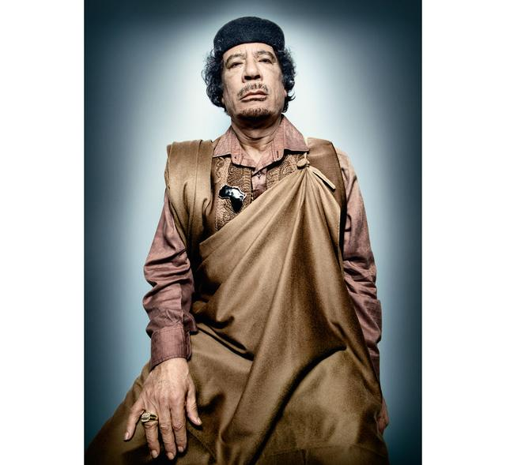

# 卡扎菲（Muammar Gaddafi）

- 姓名：卡扎菲（Muammar Gaddafi）
- 性别：男
- 国籍：利比亚
- 出生日期：1942年6月7日
- 去世日期：2011年10月20日
- 去世原因：在内战中身亡

# 生平简介

穆阿迈尔·卡扎菲，利比亚政治家、革命家，生于利比亚苏尔特。1969年发动政变上台，长期担任利比亚最高领导人。2011年利比亚内战中被俘身亡，终年69岁。

# 主要贡献

执政期间推动利比亚国有化和社会福利建设，其统治和倒台深刻影响了中东局势。

# 参考资料

- 百度百科链接：https://baike.baidu.com/item/%E5%8D%A1%E6%89%8E%E8%8F%B2
